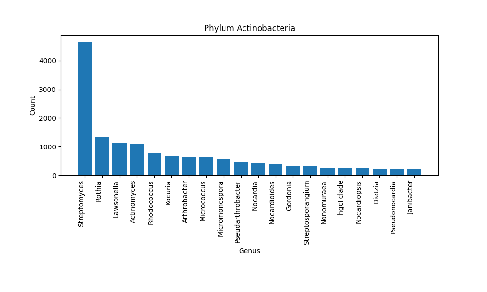

```{r setup, include=FALSE}
knitr::opts_chunk$set(echo = TRUE)
library(tidyverse)
library(kableExtra)
library(cowplot)
library(knitr)
```

\newpage

# Introduction

Rapid advancements in genomic sequencing techniques have resulted in an
exponential increase in the availability of biological sequence data
such as the 16S ribosomal DNA (16S rRNA) sequences. The 16S rRNA gene is
a highly conserved component of the 30S small subunit of prokaryotic
ribosomes. Its function is pivotal to the process of protein synthesis
within the cell. The significance of the 16S rRNA gene in scientific
research extends beyond its biological function and has become a crucial
tool for phylogenetic studies and taxonomic classification of bacteria
and archaea. The 16S rRNA gene contains nine hypervariable regions
(V1-V9) that show substantial diversity among different bacterial and
archaeal species. These variable regions are interspersed among
conserved sequences. By sequencing 16S rRNA genes, researchers can
identify and classify the microbial species present in a sample, making
it a standard method in microbial ecology, metagenomics, and microbiome
studies.

Traditional analysis methods, such as alignment-based techniques, may
become computationally expensive and potentially less accurate as the
sequence data size increases. Recent years have witnessed the rise of
machine learning, and more specifically, deep learning techniques, which
have been successfully applied in various fields, including image
recognition[@shin2016], natural language processing[@NIPS2017_3f5ee243],
and genomics [@angermueller2016]. The key advantage of deep learning is
its ability to learn complex patterns in high-dimensional data, thus
making it an attractive option for 16S rDNA sequence analysis. Given the
sequential nature of DNA, the use of convolutional neural networks is
particularly appropriate. These models are designed to take into account
the inherent sequential information within the DNA data, while also
reducing the model complexity.

In this report, deep learning techniques are for the classification of
16S rRNA genes are explored. More generally, it provides a framework for
data engineering and classifying DNA sequences of any DNA alignment. The
code base and results are openly accessible on github repository
<https://github.com/makrez/CNN_16S_classification>. The deep learning
methods in this report are based on the PyTorch library
[@NEURIPS2019_9015].

# Data description and engineering

DNA sequences are typically stored in a `.fasta` file format. Here is an
example of a single sequence in this format:

```{bash, eval=F}
>sequence_id1
ATGCCTT
```

A DNA alignment refers to a method by which multiple DNA sequences are
arranged to maximize the similarity between corresponding nucleotides at
each position. This alignment therefore identifies regions of
similarity, providing insights into the functional, structural, or
evolutionary relationships between the sequences.

An example of a DNA alignment represented in `.fasta` format could look
like this:

```{bash, eval=F}
>sequence_id1
ATGCCTT-GGCA-AGCTTGG
>sequence_id2
ATGC-ATTGGCATAAG-TGG
>sequence_id3
ATGCGTTGG-ATAAGCTTGG
>sequence_id4
ATGC-CTTGGCAT-AG-T-G
```

In this alignment, DNA sequences from four different organims are
compared. The '-' represents gaps inserted to maximize the sequence
similarity at each position. The comparison highlights the conserved
nucleotides (like 'ATGC' at the start of all sequences) and the variable
positions (such as the fifth and seventh nucleotides).

## Data source

For this project, the SILVA database (<https://www.arb-silva.de/>) was
used. This is a comprehensive resource that provides quality checked,
and regularly curated datasets of aligned small (16S/18S, SSU) and large
subunit (23S/28S, LSU) ribosomal RNA (rRNA) sequences for all three
domains of life (Bacteria, Archaea, and Eukarya). In this study, an
aligned version of reference sequences of the SSU
(<https://ftp.arb-silva.de/current/Exports/SILVA_138.1_SSURef_tax_silva_full_align_trunc.fasta.gz>)
was used. A crucial aspect of the SILVA database is that it includes
hierarchical taxonomic information for each sequence in the sequence
header. An example of a sequence header is given below:

```{bash, eval=F}
>HG530070.1.1349 Bacteria;Actinobacteriota;Actinobacteria;Actinomycetales;
Actinomycetaceae;Trueperella;Trueperella pyogenes
```

Which corresponds to the following taxonomic levels:

```{bash, eval=F}
>ncbi_identifier Domain;Kingdom;Phylum;Order;Family;Genus;Species
```

## Data description

For this project, the dataset was subset to only include Bacteria and
consists of \~1.9M sequences. The 16S sequence is typically 1500 base
pairs (1.5 kb) long. Since a very diverse set of organisms are included
in the data set, the alignment contains large amounts of gaps.
Therefore, the total length of the alignment is 50000 base pairs long.
The frequencies of bases are A: 0.73%, T: 0.6%, G: 0.91%, C: 0.66%. The
remainder of poistions consists of gaps.

### Sequence Taxonomy

Each sequence contains hierarchical taxonomic information as described
above. However, many sequences do not contain all eight levels and would
have to be curated manually. Therefore, the sequences were filtered to
only include cases where the full taxonomy is known. This resulted in a
dataset of 1788512 sequences (\~1.7 M). Since machine learning
classification tasks require to have multiple samples per class, the
classes were filtered to include a minimum amount of samples per class.
The number of unique classes per taxonomic level are given in Table
\@ref(tab:classcounts).

\vspace{0.5cm}

```{r classcounts, echo=FALSE}
df <-read.table("~/cluster/data/users/mkreuzer/CNN_16S_classification/report_files/class_counts_bacteria.tsv",
                header=T)
df <- df %>%
  separate(level, into = c("taxonomic_level", "min_samples", "fraction"), sep = "_") %>%
  select(-fraction) %>%
  pivot_wider(
    names_from = min_samples,
    values_from = number
  )

names(df) <- c("classification_level", "min_10", "min_1","min_20")

df$classification_level <- factor(df$classification_level, levels = c("Kingdom", "Phylum", "Order", "Family","Genus", "Species"))
df <- df %>% select(
  classification_level, min_1, min_10, min_20
) %>% arrange(classification_level) %>%
  mutate_if(is.numeric, function(x) x-1)

df %>%
  kable(col.names = c("Classification Level", "Min 1", "Min 10","Min 20"),
        caption = "Number of classes within the domain Bacteria given a classification level. Min 1, Min 10 and Min 20 describe the number of classes that remain when each class has a minimum of 1,10 or 20 sequences."
        ) %>%
  row_spec(0, bold = T) %>%
  kable_styling(position = "center", latex_options = "hold" )
```

The taxonomic classes are highly unbalanced at every level in terms of
members per class (see Figure \@ref(fig:classhistograms)).

```{r classhistograms, echo = FALSE, fig.height=4, fig.width=8, fig.cap="The datasets are highly imbalanced. **a-f**: The number of sequences in each of the classes at a specific taxonomic level. In all cases, only classes with more than 20 sequences were retained.", fig.pos='b'}

make_classhistograms <- function(csv){
  analysis <- basename(csv)
  analysis <- str_split(analysis, "_")[[1]][3]
  dat <- read.csv(csv,
                header=T)
  nclasses= nrow(dat)
  ggplot(dat, aes(x=reorder(Classification.Level, Count), y= Count)) +
         geom_bar(stat="identity", colour = "blue") +
  labs(x=paste("Class (n=",nclasses,", min seqs: 20)")) +
  ggtitle(paste0("Classification Level: ", analysis)) +
  theme_bw() +
  theme(
    axis.text.x = element_blank(),
    panel.grid.major = element_blank(),
    panel.grid.minor = element_blank(),
    axis.title.y = element_blank()
  )
}
base_path <- "~/cluster/data/users/mkreuzer/CNN_16S_classification/data_engineering/dataset_statistics/data_descriptions/"

g1 <- make_classhistograms(file.path(base_path, "Domain_Bacteria_Kingdom_20_1.csv"))
g2 <- make_classhistograms(file.path(base_path, "Domain_Bacteria_Phylum_20_1.csv"))
g3 <- make_classhistograms(file.path(base_path, "Domain_Bacteria_Order_20_1.csv"))
g4 <- make_classhistograms(file.path(base_path, "Domain_Bacteria_Family_20_1.csv"))
g5 <- make_classhistograms(file.path(base_path, "Domain_Bacteria_Genus_20_1.csv"))
g6 <- make_classhistograms(file.path(base_path, "Domain_Bacteria_Species_20_1.csv"))

combined_plot <- plot_grid(g1,g2,g3, g4,g5,g6, nrow = 3, labels = c(letters[1:6]))
common_y_label <- ggdraw() + draw_label("Number of Sequencees per Class", angle = 90)
final_plot <- plot_grid(common_y_label, combined_plot, ncol = 2, rel_widths = c(0.1, 1))
print(final_plot)
```

## Data Engineering and Processing

### One-hot encoding

DNA sequences are represented as strings of nucleotides (A,T,C,G). In
the context of deep learning, this representation has to be one-hot
encoded. Furthermore, gaps were treated as follows: If the gap is larger
than four consecutive positions, the positions were encoded as `N`
(missing data), otherwise the data was encoded as `-`. Therefore, a
nucleotide can be encoded into six values (e.g. `[0,1,0,0,0,0]`).

This task has been achieved with the custom python class `hot_dna`. To
instantiate the class, a DNA sequence and the taxonomic description as
described above have to be supplied. The methods of `hot_dna` can be
used to encode and decode a one-hot encoded DNA sequence.

```{python ,eval=F}
class hot_dna:
    ### Class for One Hot Encoding DNA sequences
    def __init__(self, sequence, taxonomy):
        sequence = sequence.upper()
        self.sequence = self._preprocess_sequence(sequence)
        self.category_mapping = {'A': 0, 'C': 1, 'G': 2, 'T': 3, 'U': 3,
                                 '-': 4, 'N': 5}
        if sequence:
            self.onehot = self._onehot_encode(self.sequence)
        # splitting by ';' to get each taxonomy level
        self.taxonomy = taxonomy.split(';')

    def _preprocess_sequence(self, sequence):
        ambiguous_bases = {'R', 'Y', 'S', 'W', 'K', 'M', 'B',
                           'D', 'H', 'V', '.',}
        new_sequence = ""
        for base in sequence:
            if base in ambiguous_bases:
                new_sequence += 'N'
            else:
                new_sequence += base
        # replace sequences of four or more '-' characters with 'N' characters
        new_sequence = re.sub('(-{4,})', lambda m: 'N' * len(m.group(1)),
                              new_sequence)
        return new_sequence

    def _onehot_encode(self, sequence):
        integer_encoded = np.array([self.category_mapping[char] for char in sequence]).reshape(-1, 1)
        onehot_encoder = OneHotEncoder(sparse=False, categories='auto',
                                       handle_unknown='ignore')
        onehot_encoded = onehot_encoder.fit_transform(integer_encoded)

        # Fill missing channels with zeros
        full_onehot_encoded = np.zeros((len(sequence), 6))
        full_onehot_encoded[:, :onehot_encoded.shape[1]] = onehot_encoded

        return full_onehot_encoded

    def _onehot_decode(self, onehot_encoded):
        # Reverse the mapping dictionary
        reverse_category_mapping = {v: k for k, v in self.category_mapping.items()}
        # Convert one-hot encoding back to integer encoding
        integer_encoded = np.argmax(onehot_encoded, axis=1)
        # Convert integer encoding back to original sequence
        original_sequence = "".join(reverse_category_mapping[i.item()] for i in integer_encoded)
        return original_sequence
```

### Processing large DNA alignments

A RAM-saving strategy was necessary for managing large DNA alignments.
The fundamental approach involved processing a single sequence at a
time, assigning it an index, and transforming the DNA string into a
one-hot encoded tensor. These results were cataloged in a dictionary and
preserved as a '.pt' file, named using the assigned index (for example,
'0.pt'). An example of the contents of a `.pt` file is given below:

```{python, eval=FALSE}
{'sequence_id': '3', 'sequence_tensor': tensor([[0., 0., 0., 0., 0., 1.],
        [0., 0., 0., 0., 0., 1.],
        [0., 0., 0., 0., 0., 1.],
        ...,
        [0., 0., 0., 0., 0., 1.],
        [0., 0., 0., 0., 0., 1.],
        [0., 0., 0., 0., 0., 1.]])}
```

The taxonomy information of the sequences were stored in a list and
saved a a `pickle` file. The list consists of a dictionary with the
correspoding index and the taxonomy labels:

```{python, eval=FALSE}
{'sequence_id': '3', 'label': ['FW369114.1.1462', 'Bacteria',
'Proteobacteria', 'Alphaproteobacteria', 'Rhizobiales',
'Xanthobacteraceae', 'Bradyrhizobium', 'unidentified']}
```

The full dataset was created with the script `process_data.py`, where
the main function is given below. The runtime of this operation was
approximately six hours.

```{python, eval=FALSE}
def process_sequences(msa_file_path, alignment_length, sequence_path,
                      full_taxonomy_labels, original_indices):
    full_labels = []

    with open(msa_file_path) as handle:
        for i, record in enumerate(SeqIO.parse(handle, 'fasta')):
            if i not in original_indices:
                continue

            if len(str(record.seq)[:alignment_length]) == alignment_length:
                encoded_dna = hot_dna(str(record.seq)[:alignment_length],
                                      record.description)
                sequence_tensor = torch.tensor(encoded_dna.onehot).float()

                original_index = original_indices.index(i)

                sequence_id = f"{original_index}"
                torch.save({"sequence_id": sequence_id,
                            "sequence_tensor": sequence_tensor},
                            f'{sequence_path}/{sequence_id}.pt')
                full_labels.append({"sequence_id": sequence_id,
                                    "label": \
                                    full_taxonomy_labels[original_index]})

    pickle.dump(full_labels, open(f'{sequence_path}/full_labels.pkl', 'wb'))

```

### Data selection based on taxonomy

In this repository, a special focus has been set to be able to
dynamically set classification tasks at different taxonomic levels. A
part of the analyses in this report were based on 20% of the sequences
from Phylum Actinobacteria in order to classify them to genus level (see
Figure \@ref(fig:actino)). Only classes that have more than 20 sequences
per class were inlcuded. This resulted in a dataset of 92 classes with
genus *Streptomyces* being the most prominent representative (n=4702
sequences) and genus *Timonella* having the least sequences (n=20).

```{r actino, echo = FALSE,out.width="100%", fig.cap="The size and the classes of the dataset if only 20 \\%  of the sequences from the Phylum Actinobacteria are included. Only classes with more than 200 sequences are shown."}


```

The second dataset used in this study contains 80% of the Domain
Bacteria, which corresponds to 80% of the whole alignment. The minimum
number of samples per group was set to 8 or 10 and the classificaton
level was species. This dataset resulted in 4079 classes.

# Convolutional Classifier

## Models

The first deep learning method applied consists of a convolutional
classifier, where four different models were tested. The models have
similar structures, consisting of a combination of convolutional layers,
max-pooling layers, and fully connected networks. They differ mainly in
the number of layers, number of neurons in the FCN, and use of
techniques such as dropout to avoid overfitting. The complexity and
expressiveness of the models increase from SmallModel to LargerModel.
The Kaiming He initialization was employed to initialize the layers in
the models.

1.  SmallModel (trainable parameteres: \~1.7 M): This model utilizes two
    convolutional layers and two max-pooling layers, followed by a
    three-layer fully connected network (FCN). The network starts with 6
    input channels and gradually reduces down to 8 channels after the
    convolutional layers. Then, a FCN consisting of 256, 128, and
    num_classes neurons follows. The convolutional layers have
    relatively high strides (3 and 5) which might result in loss of
    spatial information.

2.  ConvClassifier2 (trainable parameters: \~8.4 M): This model
    introduces more depth with six convolutional layers and four
    max-pooling layers. The number of channels increases from 6 to 32,
    and then gradually decreases to 4. The classifier uses an FCN with a
    higher number of neurons than the SmallModel. Unlike SmallModel, it
    uses smaller strides in its convolutional layers, which could
    potentially capture more fine-grained patterns in the input data.

3.  ModelWithDropout (trainable parameters: \~8.4 M): This model is
    identical to ConvClassifier2 in terms of architecture but introduces
    dropout in the FCN. Dropout helps to prevent overfitting by randomly
    setting a fraction of input units to 0 during training, which helps
    to improve the model's generalization capability.

4.  LargerModel (trainable parameters: \~27.5 M): This model expands on
    the ConvClassifier2 and ModelWithDropout with an increased number of
    channels in the convolutional layers, going up to 64 channels. The
    FCN is also larger, potentially making this model more expressive at
    the cost of increased computational complexity and risk of
    overfitting.

## Training

The training was performed using a grid search over specified
hyperparameters. The hyperparameters were stored in the configuration
file `config.yaml`:

```{yaml, eval=FALSE}
# Data specifications
data_folder: "/scratch/mk_cas/full_silva_dataset/sequences/"
alignment_length: 50000

# Taxonomy parameters
taxonomic_level: "Phylum"
taxonomic_group: "Actinobacteria"
classification_level: "Genus"
minimum_samples_per_group: 20
fraction_of_sequences_to_use: 0.2

# Hyperparameters
lr: [0.001, 0.0001, 0.00001]
n_epoch: [50]
batch_size: [128, 64, 32]
model: [ConvClassifier2, SmallModel, ModelWithDropout, LargerModel]
```

The data was prepared by loading and filtering labels based on a
taxonomic filter specified in the configuration. The labels were then
encoded, and the data was split into training, validation, and testing
sets using the respective indices. Importantly, the data was split using
the `StratifiedShuffleSplit` function in order to keep the classes
proportionally represented.

For each parameter combination various auxiliary data such as the
classification counts, label map, and the indices of the training,
validation, and testing sets were saved. The Adam optimizer was used,
with the learning rate specified by the current parameter set. Finally,
the trained model's weights were saved.

The model was then switched to evaluation mode, and performance was
assessed on the validation set, with both the true and predicted labels
stored for later evaluation. Various evaluation metrics (like confusion
matrix, training-validation loss curves, and F1 score) were computed and
saved.

The second dataset consisted of the following settings, attempting to
classify Actinobacteria to species level:

```{yaml, eval=FALSE}
# Taxonomy parameters
taxonomic_level: "Phylum"
taxonomic_group: "Actinobacteria"
classification_level: "Species"
minimum_samples_per_group: 20
fraction_of_sequences_to_use: 1

# Hyperparameters
lr: [0.001]
n_epoch: [30]
batch_size: [32]
model: [ConvClassifier2]
```

## Results

Each model has been trained for 30 epochs and the F1 score calculated.
The results are displayed in Figure \@ref(fig:modelcomparisoncc).
Overall, a lower batch size (32) outperformed batch sizes 64 and 128.
The best results were achieved with the model `ConvClassifier2` and a
learning rate of 0.0001 with an F1 score of 0.98. score was 0.98.
Therefore, this model and settings were used for assessing the final
performance with the test data. The results are displayed as a confusion
matrix in Figure \@ref(fig:confusionmatrix). The F1 score was 0.99.

For the second dataset where a species-level classification was
attempted the F1 score was 0.79. However as shown in Figure
\@ref(fig:trainingactinospecies), the model seems to rapitdly over-fit.

```{r modelcomparisoncc, fig.cap = "Comparison of different models with different hyperparameters.", echo=F}
dat <- read.csv("~/cluster/data/users/mkreuzer/CNN_16S_classification/convolutional_classifier/results/f1_scores_actinobacteria_genus.csv", header = F)
names(dat) = c("classification", "f1")

fields <- c("tax_group","classification_level","tmp", "min_seqs", "tmp5", "fraction",
            "model", "tmp2", "batch_size", "tmp3", "learning_rate",
            "tmp4", "number_of_epochs")

dat %>%
  separate(classification,into = fields, sep = "_") %>%
  select(!contains("tmp")) %>%
  ggplot(aes(x=learning_rate,y=batch_size)) +
  geom_tile(aes(fill=f1)) +
  facet_wrap(~model) +
  scale_fill_continuous("F1 Score") +
  labs(title="Model evaluation",
       y = "Batch Size",
       x= "Learning Rate")
```

```{r trainingcurve, fig.cap = "Training curve of the best model ConvClassifier2" , echo=FALSE}
best_model <- "Actinobacteria_Genus_min_20_frac_0.2_ConvClassifier2_bs_32_lr_0.001_ne_30"
include_graphics(file.path("convolutional_classifier/results/",best_model,"model_evaluation/train_validation_curves.png"))
```

```{r confusionmatrix, fig.cap = "Confusion matrix of the best model.",out.width= "100%", echo=F}
include_graphics(file.path("convolutional_classifier/results/",best_model,"model_evaluation/confusion_matrix.png"))
```

```{r trainingactinospecies, fig.cap = "Training curve of species-level assignment within phylum Actinobacteria.",out.width= "100%", echo=F}
best_model <- "Actinobacteria_Species_min_20_frac_1_ConvClassifier2_bs_32_lr_0.001_ne_30"
include_graphics(file.path("convolutional_classifier/results/",best_model,"model_evaluation/train_validation_curves.png"))
```

# Variational Autoenconder

Variational Autoencoders (VAEs) are a powerful class of generative
models with diverse applications. Their utility extends to the analysis
of DNA sequences. Primarily, the focus within this scope is to delve
into the exploration of the latent space that these VAEs provide. The
main goal is to discern whether DNA sequences show a proclivity for
clustering at specific taxonomic levels.

## Model

The model consists of three main components: an encoder, a decoder, and
a reparameterization trick in the middle. It is primarily used for
unsupervised learning of hidden representations and is able to generate
new data that is similar to the training data.

1.  **Encoder**: The encoder is a deep Convolutional Neural Network
    (CNN) that reduces the dimensionality of the input data, here DNA
    sequences, and encodes it into a latent space. The encoder includes
    several Conv1d layers with ReLU activations, interspersed with
    MaxPool1d layers for down-sampling, and ends with linear layers. The
    layers are designed to progressively decrease the spatial dimensions
    while increasing the depth, thereby learning more complex
    representations.

2.  **Latent Space**: The output of the encoder is passed through two
    separate fully connected (linear) layers. One computes the mean (mu)
    and the other computes the log-variance (logvar) of the latent
    variables. These parameters are used to define a probability
    distribution of the latent variables.

3.  **Reparameterization**: This is a technique used to allow
    backpropagation through random nodes. It introduces a random
    variable so that during training, the model generates a new value in
    the latent space that maintains the distribution's randomness. This
    is performed in the reparametrize function, which calculates the
    standard deviation (std) from the logvar, generates a random tensor
    (eps), and returns a new sample from the latent distribution (mu +
    eps\*std).

4.  **Decoder**: The decoder is another deep CNN, but in reverse order
    compared to the encoder. It maps the latent space back to the
    original input dimension. The decoder contains several
    ConvTranspose1d layers with ReLU activations for up-sampling,
    interspersed with up-sampling layers to increase the spatial
    dimensions, and ends with a sigmoid activation function. The sigmoid
    function ensures the output is a probability distribution over the
    possible output values, which is suitable for a binary
    classification task such as predicting presence or absence of a
    particular feature in a DNA sequence.

In the forward function, the model first applies the encoder to the
input, then the reparameterization, and finally the decoder. The model
returns the reconstructed input, as well as the mean and log-variance of
the latent variables. These outputs were then used in a loss function to
train the model: the reconstruction loss measures how well the model can
reconstruct the input, and the KL divergence measures how much the
latent variable distribution deviates from a prior (usually a standard
normal distribution).

The latent space was set to 10 dimensions.

## Trainig

For the variational autoencoder, sequences which were member of a
species that had at least 8 members were used for filtering and
splitting the data into train, validation and test set. This resulted in
a data set of 227,835 sequences from 4079 species.

During the training, the loss was calculated as the sum of the
reconstruction loss (binary cross-entropy between reconstructions and
original sequences) and the Kullback-Leibler divergence (KLD) for latent
variable parameters. The trainig was run for 200 epochs on 2 GPUs for a
total training time of \~180 hours.

## Results

The training curve is shown in Figure \@ref(fig:trainigvae).

```{r trainigvae, fig.cap = "Confusion matrix of the best model.",out.width= "100%", echo=F}
best_model <- "Bacteria_Species_min_8_ConvVAE_bs_32_lr_0.001_ne_200"
include_graphics(file.path("vae/results/",best_model,"model_evaluation/train_validation_curves.png"))
```

### Latent Space Exploration

For the latent space exploration, The test data was then encoded using
the trained model. The main aim was to graphically explore whether
different taxonomical categories cluster in the latent space, using tsne
dimensionality reduction. Since the test data set consisted of 34177
sequences, the dimensionality reduction was done using subsets of
different taxonomical levels.

In the first evaluation, the same taxonomic group was investigated as in
the convolutional classifier above. Sequences from phylum Actinobacteria
were mapped into the latent space and coloured based on the Order (one
taxonomic level below Phylum). As can be seen in Figure
\@ref(fig:tsneactinoorder), the latent space already fails to represent
the different orders of the phylum Actinobacteria. Interestingly, the
latent space is able to at least separate the Streptomycetales from the
other sequences. The Streptomycetales are the largest group in this
comparison (n=375). The clustering becomes worse, if we go into more
specific taxonomic levels. a tsne plot of the clustering Genus is given
below in Figure \@ref(fig:tsneactinogenus).

```{r tsneactinoorder, fig.cap = "tSNE plot of the phylum Actinobacteria. The legend shows the Order of the sequences.",out.width= "100%", echo=F}
include_graphics(file.path("vae/results/",best_model,"plots/tsne_plot_PhylumIsActinobacteriafraction_0_1_Order.png"))
```

```{r, echo=FALSE, include=FALSE}
tsne_data <- read.csv(file.path("vae/results/",best_model,"plots/tsne_data_PhylumIsActinobacteriafraction_0_1.csv"))

tsne_data %>%
  group_by(Order, Family) %>%
  summarise(n=n()) %>%
  arrange(desc(n))
```

```{r tsneactinogenus, fig.cap = "tSNE plot of the phylum Actinobacteria. The colours correspont to the taxonomic level Genus.",out.width= "100%", echo=F}
include_graphics(file.path("vae/results/",best_model,"plots/tsne_plot_PhylumIsActinobacteriafraction_0_1_Genus.png"))
```

In order to assess the performance on the highest level, it makes sense
to how the sequences cluster at the highest possible level (Kingdom).
Figure \@ref(fig:tsnebactkindgom) shows how 1594 randomly chosen
sequences cluster accordingly. As can be seen, the sequences do cluster
at least for the groups Firmicutes and Proteobacteria. Similarly, some
clustering can be observed in the tSNE plot on the level Phylum (Figure
\@ref(fig:tsnebactphylum)), if ten times more sequences from the test
set were sampled.

```{r tsnebactkindgom, fig.cap = "tSNE plot of the 1594 randomly chosen sequences. The colours correspont to the taxonomic level Kingdom, which is the hierarchically next level below..",out.width= "100%", echo=F}
include_graphics(file.path("vae/results/",best_model,"plots/tsne_plot_DomainIsBacteriafraction_0_01_Kingdom.png"))
```

```{r tsnebactphylum, fig.cap = "tSNE plot of the 15949 randomly chosen sequences. The colours correspont to the taxonomic level Phylum.",out.width= "100%", echo=F}
include_graphics(file.path("vae/results/",best_model,"plots/tsne_plot_DomainIsBacteriafraction_0_1_Phylum.png"))
```

# Discussion

This study had sveral aims: First, it provides a toolkit for working
with DNA sequence alginment. Secondly, it explores a convolutional
classifier and thirdly, applies an autoencoder to the data.

The data processing toolkit presented in this study allows to easily
adapt any DNA sequence alignment with the corresponding taxonomical
levels in the header for machine learning tasks. A major challenge is to
select a taxonomic level of interested and to split the dataset
sequences evenly according to a target taxonomy level.

The computational toolkit that was developed and introduced in this
study facilitates the transformation of DNA sequence alignments for
machine learning applications, specifically accommodating alignments
with associated taxonomic information in the header. One of the primary
hurdles in taxonomically classifying DNA sequences is the selection of
an appropriate taxonomic level of interest and the subsequent
partitioning of the dataset's sequences. The toolkit directly addresses
this challenge, enabling researchers to easily specify their target
taxonomic level and ensure a balanced distribution of classes according
to the chosen taxonomic level. Therefore, these utilitiess can to
substantially streamline the data processing pipeline for DNA
sequence-based machine learning tasks.

The data presented in this study use an alignment of \~1.9M sequences,
which is considerably larger to other deep learning studies for 16S
classification[@deregt2005a; @desai2020a; @rizzo2016a]. Furthermore, the
alignment used in this study is \~50kb long which is also considerably
larger than in other studies (e.g @rizzo2016b ). However, it is
important to note that the 16S RNA gene is usually only \~1.5kb long.
The very gappy alignment used in this study is potentially problematic
and may impair the learning progress. Large amounts of gaps or missing
data, lead to data sparsity. Many machine learning models, especially
deep learning models, struggle with sparse data because the lack of
information makes it harder to accurately learn and generalize patterns
in the data. I would be interesting to compare the models with sequences
from a different data source (e.g. [Greengenes
Databases](https://greengenes.secondgenome.com/). The choice for the
SILVA database was primarily due to the high number of sequences.

The convolutional classifier had a very high success rate for
classifying genera within the phylum Actinobacteria (see Figure
\@ref(fig:confusionmatrix)) with an F1 score close to 1. The
classification to genus level is in general regarded as a relatively
easy task given the current methods (e.g. @callahan2016). Therefore,
this result is only of minor interest and importance. The classification
to species-level, however, did only yield a classification success of
0.8, suggesting that further models and methods need to be evaluated.

Similarly, the autoencoder failed to identify clusters at deep taxonomic
levels in the latent space. A potential problem could be the choice of
the latent space where only ten latent dimensions were chosen.
Furthermore, additional training may be necessary to be able to
accurately map this highly-dimensional dataset into a latent space. In
the training curve in Figure \@ref(fig:trainigvae), pronounced spikes
can be observed. This may have a few reasons: The learning rate may be
too high, leading to jumps in the model's performance. Another reason
could be that the batch size leads to a noisier gradient descent. It may
also that there are several outliers in the data and that within a small
batch, a few outliers have a strong influence on the performance from
one epoch to the other.

In conclusion, traditional methods are far superior to the methods
presented here. However, further adjustments to the hyper-parameter
grid, more complex models and training could eventually provide useful
classification methods for the scientific community. It has been shown
that attention-based mechanisms for classifying DNA sequences has
significant potential [@zhao2021].

\newpage

# References
